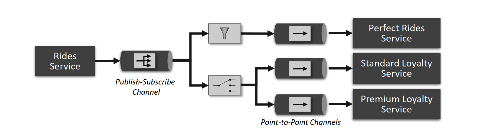
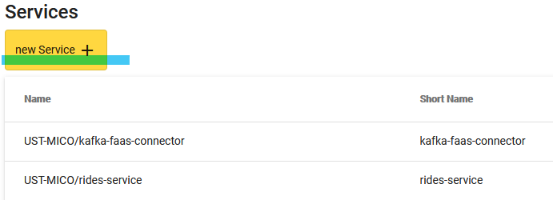
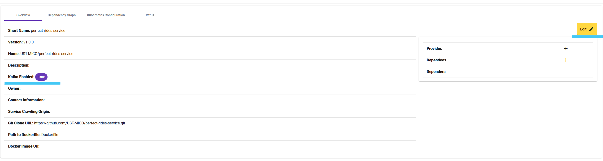
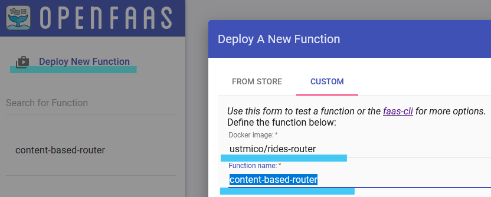
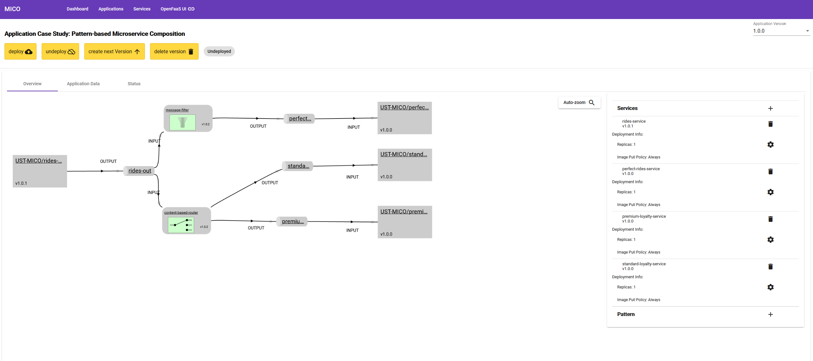
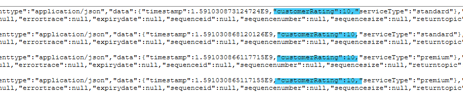

# Case Study: Pattern-based Composition of Microservices

This document describes how to run an example of pattern-based microservice integration using the MICO prototype. As shown in the figure below, the modeled integration comprises four microservices, namely *Rides Service*, *Perfect Rides Service*, *Standard Loyalty Service*, and *Premium Loyalty Service*. These components are integrated using the implementations of Content-based Router and Message Filter EIP patterns. 



## General Steps
1. Run MICO System
2. Import microservices
3. Import pattern implementations
4. Model the integration
5. Deploy and test the message routing

## Step 1: Run MICO System
MICO depends on multiple software components such as Apache Kafka, OpenFaaS, Redis and Neo4j, etc.
More information about installation and required software can be found [here](https://mico-docs.readthedocs.io/en/latest/setup/setup.html#installation). Note that Knative Build is no longer used for image building, instead the latest version of MICO uses Tekton Pipelines for enabling the source-to-image build workflow.

To simplify testing this example, we describe how to run the system on a local Minikube cluster using the self-contained setup script which can install all required components. Assuming that the recent versions of [Docker](https://www.docker.com/products/docker-desktop) and [Minikube](https://minikube.sigs.k8s.io/docs/start/) are installed, follow the following sequence of commands:

```bash
# run minikube
minikube start --driver=docker

# run the mico/install/kubernetes/setup.sh
./setup.sh

# run and open kubernetes dashboard to monitor component installation status
minikube dashboard
```

The setup script requires having the following environment variables defined for the source-to-image builds:
| Variable | Description |
|----------|-------------|
| DOCKERHUB_USERNAME | Dockerhub user account (plain text), e.g., ustmicobuildbot                  |
| DOCKERHUB_PASSWORD | Dockerhub user password (plain text), e.g., MY_SECRET_PASSWORD              |
| DOCKERHUB_URL      | Dockerhub registry for pushing images, e.g., docker.io/ustmico |

After everything is installed, expose the ports for the MICO frontend and OpenFaaS gateway Services:

```bash
# Expose MICO's frontend on localhost:4200
kubectl port-forward svc/mico-admin -n mico-system 4200:80

# Expose OpenFaaS UI on http://localhost:8081/ui
kubectl port-forward svc/gateway -n openfaas 8081:8080
```


## Step 2: Import Microservices
All the aforementioned services are implemented as simple message generators and consumers, that use the schema defined following the CloudEvents spec as a message format. The following services have to be imported into the system:
1. **Rides Service**: a Python application that generates messages containing the information about rides, [available here](https://github.com/UST-MICO/rides-service).
2. **Perfect Rides Service**: a Java application that expects messages with rides that have rating in-between 9 and 10, [available here](https://github.com/UST-MICO/perfect-rides-service). The recieved messages can be monitored using its message viewer interface available at `http://localhost:8090/messageViewer.html`.
3. **Standard Loyalty Service**: a Java application that expects messages from clients of type `standard`, [available here](https://github.com/UST-MICO/standard-loyalty-service). The recieved messages can be monitored using its message viewer interface available at `http://localhost:8090/messageViewer.html`.
4. **Premium Loyalty Service**: a Java application that expects messages from clients of type `premium`, [available here](https://github.com/UST-MICO/premium-loyalty-service). The recieved messages can be monitored using its message viewer interface available at `http://localhost:8090/messageViewer.html`.
 
**How to import**: import the services using the `new Service` button in the UI as shown below:


**Configure the service to be kafka-enabled**: After importing a service, click the `Edit` button and set the service to be `Kafka Enabled`:


To learn more about using MICO, one can complete the tutorials [available here](https://mico-docs.readthedocs.io/en/latest/tutorials/index.html).


## Step 3: Import Pattern Implementations
To import the pattern implementations, one can use `faas-cli` from OpenFaaS, or the OpenFaaS UI which is available on the port exposed in Step1. The pattern implementations are available in the folder `pattern-implementations` of this repository. To deploy them using `faas-cli` please follow the description [provided here](https://mico-docs.readthedocs.io/en/latest/setup/kubernetes/openfaas.html).

These pattern implementations are already available as Docker images `ustmico/rides-router` and `ustmico/rides-filter`. To import them using OpenFaaS UI, simply click `Deploy New Function` in the UI and choose `Custom` tab. Afterwards, specify the aforementioned Docker images and function names, e.g., `content-based-router` and `message-filter` respectively.




## Step 4: Model the Integration

As described in this [MICO tutorial](https://mico-docs.readthedocs.io/en/latest/tutorials/05-messaging-based-applications.html), create an application that includes all imported services (kafka-connector service does not need to be imported, it is used internally), and model the integration shown in the main description figure by connecting respective services and patterns by means of topics. When imported, all services are drawn as grey boxes. 
**To create a topic**: drag an edge from the service (or pattern) node to the canvas, type in the topic name and choose its role (input/output).
**To create a pattern**: drag an edge from the topic node to the canvas. After a generic kafka-connector node is created, click on its name and choose the respective pattern implementation, e.g., `message-filter`.
**Requirement**: input topics for *Standard Loyalty Service* and *Premium Loyalty Service* must be named `standard-in` and `premium-in`, respectively.
After modeling the integration, the resulting model should look similar to the following example:



## Step 5: Deploy and Test the Message Routing

After the model is created, one can deploy it to the Kubernetes cluster by clicking the `Deploy` button in the top-left corner of the user interface. When the button is pressed, the MICO system triggers source-to-image builds for every involved service and translates the resulting images into Kubernetes Deployments. The deployment status can be monitored using Kubernetes Dashboard as discussed in the Step1 or using `kubectl` commands. 

To speed up the deployment, it is possible to skip the image building step by specifying the following docker image URIs for every imported service:
1. Rides Service: `docker.io/ustmico/rides-service:v1.0.1`
2. Perfect Rides Service: `docker.io/ustmico/perfect-rides-service:v1.0.0 `
3. Standard Loyalty Service: `docker.io/ustmico/standard-loyalty-service:v1.0.0 `
4. Premium Loyalty Service: `docker.io/ustmico/premium-loyalty-service:v1.0.0 `

After the modeled integration is successfully deployed, one can monitor the message routing by exposing the port of the respective Kubernetes pod and observing the messages. For example:

```bash
# Show all pods in the mico-workspace namespace
kubectl get pods -n mico-workspace

# Expose port 8090 for the pod 'perfect-rides-service-67vml3zb-57b9d844cf-tmrvk'
kubectl port-forward perfect-rides-service-67vml3zb-57b9d844cf-tmrvk -n mico-workspace 8090
```
After exposing the port, one can observe the received messages at the following address: `http://localhost:8090/messageViewer.html` and verify that, e.g., all messages' rating is greater or equal to 9.


